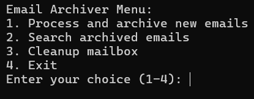

# Email Archiver 📂✉️

Automatically collects, sorts, and archives email attachments with full search functionality.



## Features ✨

- 📥 Automatic download of email attachments
- 🗂️ Intelligent organization by date/sender/file type
- 🔍 Powerful search across archived emails
- 🗑️ Automatic mailbox cleanup (optional)
- 🔒 Secure credential management
- 📊 SQLite database for tracking all archives

## Installation ⚙️

### Prerequisites
- Python 3.10+
- IMAP-enabled email account
- App password if using 2FA

### Steps
```bash
# Clone the repository
git clone https://github.com/yourusername/email-archiver.git
cd email-archiver

# Install dependencies
pip install -r requirements.txt

# Set up configuration
cp config/.env.example .env
Configuration ⚙️
Edit the .env file with your details:

ini
EMAIL=your.email@example.com
PASSWORD=your_app_password  # Use app password if 2FA is enabled
IMAP_SERVER=imap.gmail.com  # For Gmail, adjust for other providers
ARCHIVE_ROOT=./email_archive
DELETE_AFTER_ARCHIVE=False  # Set to True to automatically delete processed emails
Usage 🚀
Basic Operation
bash
python src/email_archiver.py
Command Line Options
bash
# Run in automatic mode (process and exit)
python src/email_archiver.py --auto

# Specify custom config path
python src/email_archiver.py --config /path/to/config.env

# Run search only
python src/email_archiver.py --search "invoice Q3"
Interactive Menu
When running without arguments, you'll see:

text
Email Archiver Menu:
1. Process and archive new emails
2. Search archived emails
3. Cleanup mailbox
4. Exit
Project Structure 🗂️
text
email-archiver/
├── src/                   # Source code
│   ├── __init__.py        # Package definition
│   └── email_archiver.py  # Main application
├── config/
│   └── .env.example       # Configuration template
├── email_archive/         # Archived files (auto-created)
├── email_archive.db       # Database (auto-created)
├── requirements.txt       # Dependencies
└── README.md              # This file
Security 🔒
Never commit your .env file

Use app passwords instead of your main email password

The database stores metadata but not email content

Contributing 🤝
Pull requests are welcome! For major changes, please open an issue first.

License 📄
MIT